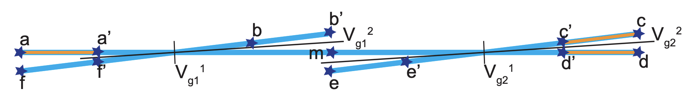

# TQC Nanowire Compiler

## About
In Topological Quantum Computing, quasiparticles such as Majorana fermions are braided in a specific pattern to obtain single- or multi-Qubit Quantum gates. Serial or concurrent combinations of braid sequences between 2 particles represent these braid patterns. Each of these braid sequences correspond to a set of movements of these particles on a Nanowire.

This project is a simulation, which ultimately constructs a matrix representing movements of these particles on a Nanowire, thereby forming braids.

## TQC Nanowire Compiler

### Preprocessing - Nanowire structure

1. Given a Nanowire structure, an **Adjacency matrix** is constructed, which is used to determine the paths that the particles take in order to form a braid. In the program, ```nanowire-graph.py``` performs this preprocessing. It takes as input ```nanowire-structure.csv``` and outputs the adjacency matrix into ```nanowire-matrix.csv``` and the nanowire vertices into ```nanowire-vertex.csv```.

2. **Representation of the Nanowire** must follow certain rules:
    - Sequence of the branches is **Anti-clockwise**
    - Sequence of the branches is **Topmost and Leftmost**
    - Naming Sequence of the positions is **Outward to inward**
    - Each intersection is followed by the **Voltage gates**



3. This is a Double-X junction Nanowire. It would be represented in (```nanowire-structure.csv```) as:
```
b,b'
a,a'
f,f'
m
x11,x12
c,c'
m
e,e'
d,d'
x21,x22
```

4. One of the outputs of ```nanowire-graph.py``` is a sequence of vertices of the Nanowire, saved in ```nanowire-vertex.csv```. One of the sequence is ```m,d',a',b',a,c,b,f',e,c',f,d,x2,e',x1```.

5. The other output of ```nanowire-graph.py``` is the adjacency matrix of the Nanowire, saved in ```nanowire-matrix.csv```. The matrix for the above sequence and the given nanowire structure is
```
1,0,0,0,0,0,0,0,0,0,0,0,1,0,1
0,1,0,0,0,0,0,0,0,0,0,1,1,0,0
0,0,1,0,1,0,0,0,0,0,0,0,0,0,1
0,0,0,1,0,0,1,0,0,0,0,0,0,0,1
0,0,1,0,1,0,0,0,0,0,0,0,0,0,0
0,0,0,0,0,1,0,0,0,1,0,0,0,0,0
0,0,0,1,0,0,1,0,0,0,0,0,0,0,0
0,0,0,0,0,0,0,1,0,0,1,0,0,0,1
0,0,0,0,0,0,0,0,1,0,0,0,0,1,0
0,0,0,0,0,1,0,0,0,1,0,0,1,0,0
0,0,0,0,0,0,0,1,0,0,1,0,0,0,0
0,1,0,0,0,0,0,0,0,0,0,1,0,0,0
1,1,0,0,0,0,0,0,0,1,0,0,1,1,0
0,0,0,0,0,0,0,0,1,0,0,0,1,1,0
1,0,1,1,0,0,0,1,0,0,0,0,0,0,1
```

### Preprocessing - Braid sequence


1. Given a Braid pattern for a Quantum gate, it needs to be processed into a sequence of braids between 2 particles. These sequences, in turn, combine to form the braid pattern. For this Braiding pattern, which is a 2-Qubit CNOT gate, the braid sequence saved in ```braid-sequence.csv``` is:
```
3,4
3,5
1,2
4,5
3,6
4,6
5,6
```

### Preprocessing - Initial Particle positions

A file, ```particle-positions.csv```, contains the initial positions of the particles on the Nanowire. In the above example, it is ```a,a',c,c',d,d'```.

### File arguments

The files mentioned above are provided as arguments to the main file, ```tqc-compiler.py```:
1. ```nanowire-structure.csv```
2. ```nanowire-vertex.csv```
3. ```nanowire-matrix.csv```
4. ```braid-sequence.csv```
5. ```particle-positions.csv```
6. ```particle-movements.csv```
7. ```particle-states.csv```

### TQC Braiding Nanowire Algorithm

#### Algorithm Rules

1. **Braiding Concurrency limits** - there is a limit on the # concurrent braiding operations
    - There is a layer of optimisation which can be
2. **Braiding movements** - Every braiding operation puts the particles back in their respective final positions.
    - There is a layer of optimisation possible here. The particles can be placed in an intermediate position, so long as it does not violate any rules, interfere with other braiding operations or is needed in subsequence braiding operations.
3. **Nanowire State validity** - Every braiding operation MUST result in a valid Nanowire state. Validity can be generic or for the next braiding operation.
    - Both 1. and 2. MUST satisfy 3. EVERY braiding operation, either optimised or not, concurrent or not, must result in a valid Nanowire state.
4. **Atomic Braiding operation** - Every braid involves 2 particles, i.e., BOTH these particles needs to be moved in a braiding operation.
    - As the state before the braiding is valid, there is no obstruction during braiding for any particle.
5. **Particle-Zero mode isolation** - No two particles from different zero modes can occupy adjacent positions on the Nanowire during the braiding operation.
    - After the braiding is completed, they can only occupy the valid final positions.

#### Braiding steps

1. Get Final Positions
2. Validate Resulting State
3. Perform Braiding
    - Get Empty Positions - on adjacent empty branches
    - Get Voltage Changes - if braiding involves particles from different zero modes
    - Update Adjacency Matrix - Gate variation may create a disconnected graph
    - Get Shortest Path - Dijkstra's
    - Update Nanowire position
    - Update Particle positions
