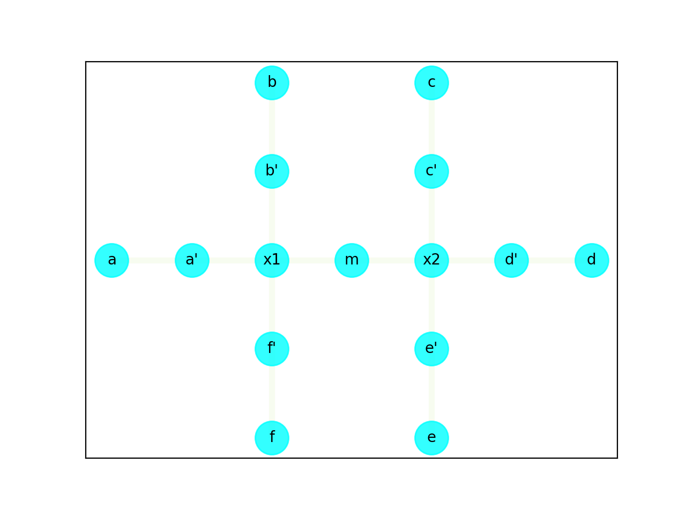
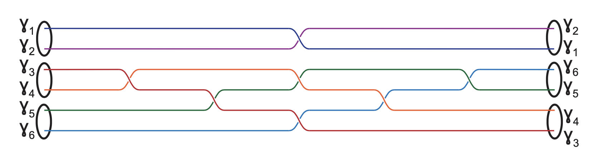

# TQC Compiler Algorithm

The algorithm consists of the following steps:
1. Preprocessing - Nanowire
1. Preprocessing - Braid sequence
1. Algorithm rules
1. Algorithm - Validation phase
1. Algorithm - Braiding phase

## TQC Preprocessing Phase

### TQC Compiler - Preprocessing Nanowire

1. Given a Nanowire structure, an **Adjacency matrix** is constructed, which is used to determine the paths that the particles take in order to form a braid. In the program, `nanowire.py` along with `graph.py` performs this preprocessing. The input to this module is specified in `nanowire-structure.csv`, in a certain format. The outputs, the adjacency matrix is saved into `nanowire-matrix.csv` and the nanowire vertices into `nanowire-vertices.csv`.

2. Representation of the Nanowire must follow certain **rules**:
    - Sequence of the branches is **Counter-clockwise** and starts from the **Topmost** branch
    - The sequence of positions is **Outward to Inward**
    - Each intersection is followed by the **Voltage gates**
    - The voltage gate in the **top-right** quadrant is represented first


3. This is a Double-X junction Nanowire. It would be represented in (`nanowire-structure.csv`) as:
```
b,b'
a,a'
f,f'
m
x11,x12
c,c'
m
e,e'
d,d'
x21,x22
```

4. One of the outputs of this preprocessing stage is a sequence of vertices of the Nanowire, which is saved in `nanowire-vertices.csv`. One of the sequence for the given nanowire above is `m,d',a',b',a,c,b,f',e,c',f,d,x2,e',x1`.

5. The other output is the adjacency matrix of the Nanowire, saved in `nanowire-matrix.csv`. The matrix for the above sequence and the given nanowire structure is
```
1,0,0,0,0,0,0,0,0,0,0,0,1,0,1
0,1,0,0,0,0,0,0,0,0,0,1,1,0,0
0,0,1,0,1,0,0,0,0,0,0,0,0,0,1
0,0,0,1,0,0,1,0,0,0,0,0,0,0,1
0,0,1,0,1,0,0,0,0,0,0,0,0,0,0
0,0,0,0,0,1,0,0,0,1,0,0,0,0,0
0,0,0,1,0,0,1,0,0,0,0,0,0,0,0
0,0,0,0,0,0,0,1,0,0,1,0,0,0,1
0,0,0,0,0,0,0,0,1,0,0,0,0,1,0
0,0,0,0,0,1,0,0,0,1,0,0,1,0,0
0,0,0,0,0,0,0,1,0,0,1,0,0,0,0
0,1,0,0,0,0,0,0,0,0,0,1,0,0,0
1,1,0,0,0,0,0,0,0,1,0,0,1,1,0
0,0,0,0,0,0,0,0,1,0,0,0,1,1,0
1,0,1,1,0,0,0,1,0,0,0,0,0,0,1
```

Below is the graphical reconstruction of the Nanowire...



### TQC Compiler - Preprocessing Braid sequence

Given a Braid pattern for a Quantum gate, it needs to be processed into a sequence of braids between 2 particles. Orderly execution of these sequences result in the braid pattern.



This is the Braiding pattern for a 2-Qubit CNOT gate, and the braid sequence (saved in `braid-sequence.csv`) is:
```
3,4
3,5
1,2
4,5
3,6
4,6
5,6
```

### TQC Compiler - Preprocessing Particle positions

A file, `initial-positions.csv`, contains the initial positions of the particles on the Nanowire. In the above case, it is `a,a',c,c',d,d'`.

This stage is triggered before the execution of the algorithm for every gate. It checks if the positions of particles on the branch and intersections are in a valid state to perform the required braiding. If not, it tries to move the necessary particles into a valid state. If it cannot move, then it returns with an exit status 1 and the program stops.

This step is important in 2 scenarios:
1. **Gates** - Each gate requires a certain arrangement of the particle-populated branches.
    - **Hadamard** and **Pauli-X** gates need them to be on **opposite** branches in an intersection.
    - **CNOT** gate need them to be on **adjacent** branches in **clockwise** order.
    - Therefore, given any random arrangement of particles on the Nanowire, this step moves them into these valid positions on the branches.
1. **Circuits** - Here, the output of one gate feeds into another.
    - Some of the particles may need to be moved before the execution of the next gate, as mentioned previously.

##### Entanglement circuit

In the case of an entanglement circuit, we have a **Hadamard** gate followed by a **CNOT** gate. The 1st 4 particles are on the **1st intersection** for the Hadamard gate. For the CNOT braiding to happen, we need the latter two particles from the Hadamard braiding. We therefore need to move them into the **2nd intersection** where the remaining 2 particles are.

With the given initial positions `[b,b',f',f]` for the Hadamard gate, the final position after the Hadamard braiding is `[f',b',b,f]`. Now, we need particles `(2, 3)`, which are at positions `(b', b)`, for the CNOT braiding. These need to be moved into the 2nd intersection onto a valid branch. Given the remaining 2 particles occupy positions `(d, d')` then they need to be moved into positions `(c, c')`. The path for particle `2` is `[b', x1, m, x2, c', c]` and for particle `3` is `[b, b', x1, m, x2, c']`.

Now, the CNOT braiding can commence.

## TQC Compiler Phase

### Algorithm - Rules

1. **Nanowire State validity**
    - EVERY braiding operation, optimized or not, concurrent or not, MUST result in a valid Nanowire state.
    - Validation can be generic or for the next braiding operation.
    - This requirement helps in establishing the _correctness_ of the algorithm and eventually makes debugging simpler.
2. **Atomic Braiding operation**
    - Every braid involves 2 particles, i.e., BOTH these particles need to be moved in a braiding operation.
    - As the state before the braiding is valid, there is no obstruction during braiding for any particle.
3. **Particle-Zero mode isolation**
    - No two particles from different zero modes can occupy adjacent positions on the Nanowire during the braiding operation.
    - When 2 particles from different zero-modes are being braided, their **non-participating** zero-mode paired particles cannot be on the same crossing, as this would cause them to unite and destroy the operation.
    - This would involve **voltage regulation** to ensure that this doesn't happen.
4. **Braiding Sequence**
    - The sequence of the braids must be strictly followed for the given gate and braiding pattern.
    - Any random, unintended braid sequence may lead to a different gate and hence is disallowed.
5. **Braiding Concurrency limit**
    - There is a limit on the # concurrent braiding operations
    - There is a layer of optimization, where more than one braiding optimization can be performed simultaneously, depending on the nanowire structure.
6. **Intermediate positions**
    - Every braiding operation puts the particles back in their respective final positions.
    - There is a layer of optimization possible here. The particles can be placed in an intermediate position, so long as it does not violate any rules, interfere with other braiding operations or is needed in subsequence braiding operations.
7. **Braiding rotation**
    - Mathematically, clockwise braiding results in a Matrix which is different than counter-clockwise braiding.
    - If a counter-clockwise braiding of 2 particles involves movements in vertical-top followed by vertical-bottom branches, then a clockwise braiding would be the opposite.
    - If a counter-clockwise braiding involves horizontal followed by vertical branches, then a clockwise braiding would (probably) be vertical followed by horizontal.
    - The detail mechanics on the Nanowire still need to be worked out. This would essentially be another layer of upgrade on top of the current, basic one. The default would always be counter-clockwise.
8. **Fusion**
    - For fusion, the particles involved must be adjacent to each other.
    - Depending on the fusion rules and fusion channels, the measurement is determined.

### Algorithm - Validation phase

1. **Retrieve Final Positions**
    - Retrieve the **expected final positions** for the participating particles, AFTER the Braiding operation is completed.
    - get **empty positions** on adjacent empty branches which returns both nearest and farthest locations on the branch
    - There can be **multiple** final positions, if there are more than one free branches.
    - If there are no empty branches available, then a `NoEmptyPositionException` exception is raised and the **braiding stops**
    - These positions are then **ranked** based on their
        - Nanowire Validity score,
        - Number of steps, and
        - If the positions are useful in further braiding

2. **Retrieve Intermediate Positions**
    - Retrieve the **potential intermediate positions** for the participating particles, for the current Braiding operation.
    - If there are no empty branches available, then a `NoEmptyPositionException` exception is raised and the **braiding stops**
    - Once the positions and their validity is confirmed, the particles are moved to their intermediate positions
    - 1st particle that moves gets the 1st empty branch (for now). Later, any rules/restrictions to move particles to certain branches can be specified

3. **Validate Resulting State** - **Nanowire validation algorithm**
    - The algorithm returns a `score (>= 0)` for every expected final position.
    - If `score = 0`, then the state is **invalid**, and `InvalidNanowireStateException` is raised and the **braiding stops**.
    - If `score > 0`, then the state is **valid** and it's safe to continue with the braiding.
    - Rating the Nanowire states -
        - Initially, `score = 0`.
        - If the resulting state has **at least 2** empty branches in the participating intersection, `score += 1`.
        - If the resulting states do not interfere in the movement of the 2nd particle involved in the braiding, `score += 1`.
        - If the resulting states do not interfere in the further braiding operations, `score += 1`.

### Algorithm - Braiding Phases

4. **Get Voltage Changes**
    - If the particles are from the **same** zero-mode, then voltage regulation is unnecessary. But, if braiding involves particles from **different** zero modes, perform necessary voltage gate changes. This may cut-off some branches.
    - For every particle, based on given the final position, choose whether to **open or close** the voltage gates.
    - Once the voltage gates are updated, the resultant isolated branches can be retrieved.

5. **Retrieve Isolated branches**
    - This retrieves the list of isolated branches and its positions involved in the movement of the particle.
    - The isolated branch is a subset of vertices from the original set of vertices

6. **Shortest Path**
    - **Dijkstra's algorithm** gives the shortest path for a particle from it's current (initial) position to the given (valid) final position.

7. **Update Particle Positions**
    - Generate a sequence of position-voltage pair, for every step of the particle being braided.
    - It is updated in the file `particle-movements.csv`, as shown:
