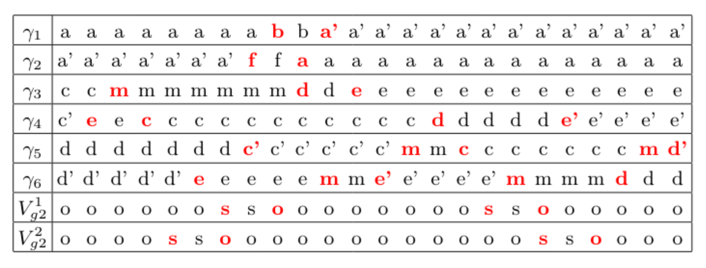

### Output

8. **Nanowire State matrix** - Generate a Nanowire State matrix, which is a sequence of positions of all particles and the corresponding gate voltage values, capturing each movement for every particle. The nanowire state matrix for the above example is show below.

```
Particle,Path,V11,V12,V21,V22
2,a'-b,O,O,O,O
1,a-a'-f',O,O,O,O
2,b-a'-a,O,O,O,O
1,f'-a',O,O,O,O
```



9. **Metrics** - Calculate metrics such as **Number of steps** (both within and between zero modes, and total), **Braiding Concurrency**, **Effective complexity**, etc.
