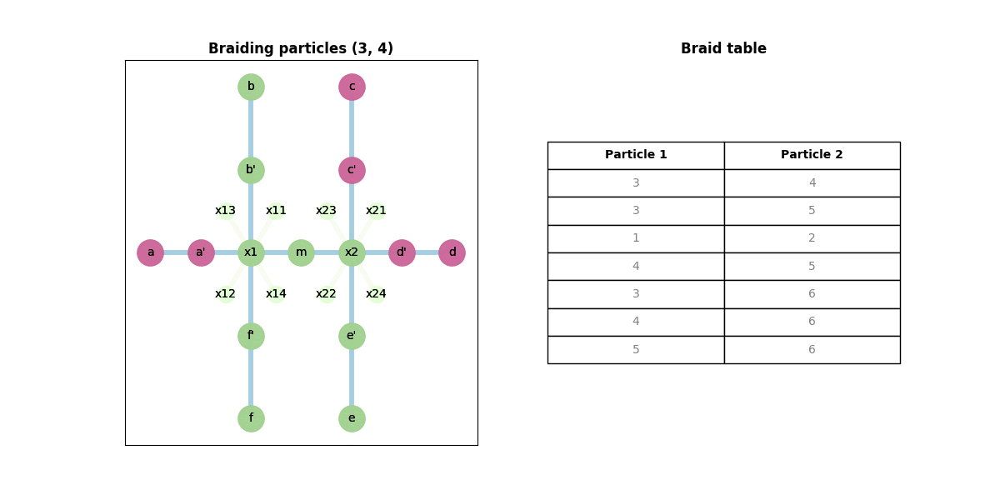
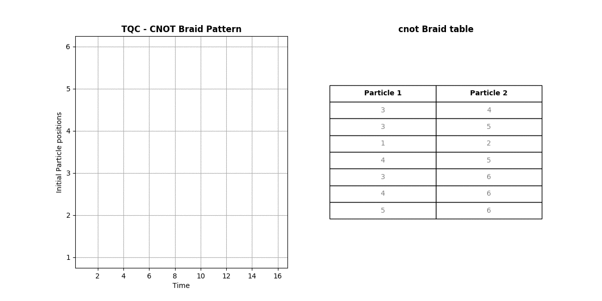

# TQC Compiler - Work Done

## Index

### Stage 1
1. Compiler architecture - initial
1. Preprocessing Nanowire
1. Algorithm - Rules
1. Algorithm - Validation phase
1. Algorithm - Braiding phase
1. 2-qubit CNOT gate implementation

### Stage 2
1. Voltage regulation
1. Braiding direction

### Stage 3
1. Animation Nanowire
1. Animation Braiding

### Stage 4
1. Measurement and Fusion

### Stage 5 - Universal gates
1. Hadamard (1-qubit)
1. Pauli X (1-qubit)
1. Phase S (1-qubit)

### Stage 6
1. Compiler architecture - redesign

## Stage 1

1. In this 1st stage, some of the rules (3, 5, 6, 7 and 8) haven't been implemented from the algorithm. And the program is for the 2-qubit **CNOT** gate.
2. The entire braiding operations are of 2 basic categories:
    - Braiding involving 2 particles on the **same branch**.
        - Sequences from the CNOT gate - `[(3, 4), (1, 2), (4, 5), (3, 6), (5, 6)]` belong to this category.
    - Braiding involving 2 particles on **different branches**
        - One particle is on the **inner position** on one branch
        - AND the other particle is on the **outer position** of the other branch
        - AND another particle on the inner position on the latter branch is blocking the latter particle. Sequences `[(3, 5), (4, 6)]` belong to this category.
        - **Voltage regulation** is required ONLY in this case.
3. The output, for the given braiding sequence, is displayed below (without the voltage values in particle-movements.csv):
```
Braiding particles (3, 4)
4,c'-x2-m
3,c-c'-x2-e'
4,m-x2-c'-c
3,e'-x2-c'
Braiding particles (3, 5)
3,c'-x2-m
6,d'-x2-e'
5,d-d'-x2-c'
3,m-x2-d'-d
6,e'-x2-d'
Braiding particles (1, 2)
2,a'-x1-b'
1,a-a'-x1-f'
2,b'-x1-a'-a
1,f'-x1-a'
Braiding particles (4, 5)
5,c'-x2-m
4,c-c'-x2-e'
5,m-x2-c'-c
4,e'-x2-c'
Braiding particles (3, 6)
6,d'-x2-m
3,d-d'-x2-e'
6,m-x2-d'-d
3,e'-x2-d'
Braiding particles (4, 6)
4,c'-x2-m
3,d'-x2-e'
6,d-d'-x2-c'
4,m-x2-d'-d
3,e'-x2-d'
Braiding particles (5, 6)
6,c'-x2-m
5,c-c'-x2-e'
6,m-x2-c'-c
5,e'-x2-c'
```

4. The Nanowire state matrix for the braiding sequence (3,5)` is (in `nanowire-states.csv`):
```
P1,P2,P3,P4,P5,P6
a,a',c',c,d,d'
a,a',x2,c,d,d'
a,a',m,c,d,d'
a,a',m,c,d,d'
a,a',m,c,d,x2
a,a',m,c,d,e'
a,a',m,c,d,e'
a,a',m,c,d',e'
a,a',m,c,x2,e'
a,a',m,c,c',e'
a,a',m,c,c',e'
a,a',x2,c,c',e'
a,a',d',c,c',e'
a,a',d,c,c',e'
a,a',d,c,c',e'
a,a',d,c,c',x2
a,a',d,c,c',d'
```

## Stage 2

5. Rule 3: **Voltage regulations** (for braiding in the 2nd category).

6. In every braiding operation, I extract the particles which are isolated (1 in a branch).
    - I then verify if these isolated particles are part of the same zero mode, or different.
    - If they are part of the **same** zero mode, then **no voltage regulation** is needed.
    - Else, I check if the particles are part of the **expected** zero modes which might be formed after braiding is completed. If so, then **no voltage regulation** is needed.
    - If both the particles are part of **neither** an **existing** or an **expected** zero mode, then the voltage gate between those respective adjacent branches need to be **shut** off.

7. In the case when a braiding operation involves 5 steps - for sequences `(3, 5)` and `(4, 6)` - the 3rd step (which involves moving particle `5` to position of particle 3 and moving particle 6 to position of particle 4 respectively) requires a toggling of both voltage gate values in the respective intersection.
    - In the 1st case, step 2 is moving particle 6: `[d', e']`. The voltage gate values `(Vg21, Vg22)` for this are `(S, O)`.
    - In step 3, which is moving particle `5`: `[d, d', c']`, the voltage gate values `(Vg21, Vg22)` are `(O, S)`.
    - Following this, in steps 4 and 5, as there is no interference between 2 particles from different zero modes, no further voltage regulation is needed.

8. I first generate a nested list of pairs of positions for which voltage gate shut is triggered. For gate `Vg21`, the pairs are `[['c', 'd'], ['c', "d'"], ["c'", 'd'], ["c'", "d'"], ['e', 'm'], ["e'", 'm']]`. So, if a pair of position of particles from different zero modes is in this list, then `Vg21` is triggered to shut. Similar is the case for other gates as well.

9. Every time the nanowire structure is updated, the zero mode pairs are also updated. While braiding particles `(3,5)` the zero mode pairs are as follows: `[(1, 2), (5, 6)], [(1, 2)], [(1, 2), (4, 5)], [(1, 2), (4, 5), (3, 6)]`

10. In every braiding operation, after every successful intermediate braiding, the voltage gates are also updated. While braiding particles `(3,5)` the voltage gate values changes as follows: `['O', 'O', 'O', 'O'], ['O', 'O', 'S', 'O'], ['O', 'O', 'O', 'S'], ['O', 'O', 'O', 'O'], ['O', 'O', 'O', 'O']`. `'O'` means a gate is open and `'S'` means it is shut. The gate array represents `[Vg11, Vg12, Vg21, Vg22]` in this order.

11. The output with the voltage changes are as follows:
    - Particle movements:
    ```
    ----- Braiding particles (3, 4) -----
    4,c'-x2-m,O,O,O,O
    3,c-c'-x2-e',O,O,O,O
    4,m-x2-c'-c,O,O,O,O
    3,e'-x2-c',O,O,O,O
    ----- Braiding particles (3, 5) -----
    3,c'-x2-m,O,O,O,O
    6,d'-x2-e',O,O,S,O
    5,d-d'-x2-c',O,O,O,S
    3,m-x2-d'-d,O,O,O,O
    6,e'-x2-d',O,O,O,O
    ----- Braiding particles (1, 2) -----
    2,a'-x1-b',O,O,O,O
    1,a-a'-x1-f',O,O,O,O
    2,b'-x1-a'-a,O,O,O,O
    1,f'-x1-a',O,O,O,O
    ----- Braiding particles (4, 5) -----
    5,c'-x2-m,O,O,O,O
    4,c-c'-x2-e',O,O,O,O
    5,m-x2-c'-c,O,O,O,O
    4,e'-x2-c',O,O,O,O
    ----- Braiding particles (3, 6) -----
    6,d'-x2-m,O,O,O,O
    3,d-d'-x2-e',O,O,O,O
    6,m-x2-d'-d,O,O,O,O
    3,e'-x2-d',O,O,O,O
    ----- Braiding particles (4, 6) -----
    4,c'-x2-m,O,O,O,O
    3,d'-x2-e',O,O,S,O
    6,d-d'-x2-c',O,O,O,S
    4,m-x2-d'-d,O,O,O,O
    3,e'-x2-d',O,O,O,O
    ----- Braiding particles (5, 6) -----
    6,c'-x2-m,O,O,O,O
    5,c-c'-x2-e',O,O,O,O
    6,m-x2-c'-c,O,O,O,O
    5,e'-x2-c',O,O,O,O
    ```

    - Nanowire states:
    ```
    P1,P2,P3,P4,P5,P6,Vg11,Vg12,Vg21,Vg22
    a,a',c',c,d,d',O,O,O,O
    a,a',x2,c,d,d',O,O,O,O
    a,a',m,c,d,d',O,O,O,O
    a,a',m,c,d,d',O,O,S,O
    a,a',m,c,d,x2,O,O,S,O
    a,a',m,c,d,e',O,O,S,O
    a,a',m,c,d,e',O,O,O,S
    a,a',m,c,d',e',O,O,O,S
    a,a',m,c,x2,e',O,O,O,S
    a,a',m,c,c',e',O,O,O,S
    a,a',m,c,c',e',O,O,O,O
    a,a',x2,c,c',e',O,O,O,O
    a,a',d',c,c',e',O,O,O,O
    a,a',d,c,c',e',O,O,O,O
    a,a',d,c,c',e',O,O,O,O
    a,a',d,c,c',x2,O,O,O,O
    a,a',d,c,c',d',O,O,O,O
    ```

12. Rule 7 - **Braiding Direction**. Here, the particle movement occurs in the opposite (clockwise) direction

13. This rule was implemented by changing the format of the `braid-sequence.csv` file.
    - It was originally of the format:
    ```
    3,4
    3,5
    1,2
    4,5
    3,6
    4,6
    5,6
    ```
    - I changed this format by adding a bit which indicates the direction of braiding rotation next to the pair or particles. `1` represents **clockwise** braiding and `0` represents **counter-clockwise** braiding (which is the default one). The new format and the corresponding output is as follows:
    ```
    3,4,1
    3,5,1
    1,2,1
    4,5,1
    3,6,1
    4,6,1
    5,6,1
    ```
    - Below is the Particle movements output for clockwise braiding. For braiding between `(3, 5)`, after the 1st step, the positions are as follows: `['a', "a'", "e'", 'c', 'd', 'm']`. The pair `["e'", 'm']` represents the particles `[3, 6]` and `["e'", 'd']` represents `[3, 5]`, BOTH of which do NOT belong to a zero mode. Therefore, the gates `[Vg21, Vg22]` must be shut, to preserve Rule 3.
    - As a result, this blocks the movement of particle 6. Hence, this braiding cannot proceed in the clockwise direction with the given initial positions.

    ```
    ----- Braiding particles (3, 4) -----
    4,c'-x2-e',O,O,O,O
    3,c-c'-x2-m,O,O,O,O
    4,e'-x2-c'-c,O,O,O,O
    3,m-x2-c',O,O,O,O
    ----- Braiding particles (3, 5) -----
    3,c'-x2-e',O,O,O,O
    The Particle (6) with Path [d',x2,m] is blocked by Voltage Gate ['Vg21']
    ```

## Stage 3

13. Animation - Used Python's Networkx and Pyplot libraries to create animations of the whole CNOT Braiding algorithm
    - Nanowire movement
    

    - Braiding animation
    

## Stage 4

14. Documentation - Following the PEP8 standards, enforced using `PyLint`.

15. Measurement - Fusion

    - Firstly, the Fusion rules are important here, which varies between particle types - Majorana, Fibonacci, etc. The Fusion rules for this project are listed in `fusion-rules.csv` as shown below. `(o, x, 1)` represent the anyons, fermions and vacuum respectively.
    ```
    P1,P2,Res
    o,o,1
    o,o,x
    1,o,o
    o,1,o
    1,1,1
    1,x,x
    x,1,x
    x,x,1
    x,o,o
    ```

    - Secondly, the Fusuon channels for anyons is as shown in the figure below.
    
    The corresponding table is in `fusion-channel.csv` as below. The 1st 2 columns represent the 2 qubits and the next (last) 3 columns, the channels, as shown in the figure.
    ```
    Q1,Q2,a,b,c
    0,0,1,1,1
    1,0,x,x,1
    0,1,1,x,x
    1,1,x,1,x
    ```

    - Thirdly, The final positions of the particles AFTER braiding is stored and they are paired based on their adjacency positions from the Nanowire Matrix graph. In this case the final positions are `a',a,d',d,c',c`. And the zero mode pairs are `(a', a)`, `(d', d)`, `(c', c)`.

    - Finally, measurement happens according to the fusion rules listed earlier. The output is listed in `tqc-fusion.csv`. The 1st 3 columns are the channels which we get when measured, and the corresponding Qubit pairs.
    ```
    Pair1,Pair2,Pair3,Qubit1,Qtubi2
    x,1,x,1,1
    x,x,1,1,0
    1,x,x,0,1
    1,x,x,0,1
    x,x,1,1,0
    x,x,1,1,0
    x,1,x,1,1
    1,x,x,0,1
    x,x,1,1,0
    x,1,x,1,1
    x,1,x,1,1
    x,1,x,1,1
    ```

    - With this stage, the entire Topological Quantum Braiding is complete, from Particle Initialization to Braiding to Measurements.

## Stage 5 - Universal Gate set

16. 
17. 
18. 

For all of these 1-qubit gates, there is a slight change in the category 2 braiding.
* Braiding involving 2 particles on **different branches**
* Here, there is no 3rd particle involved, just the 2 particles. As a result, the just follow the algorithm rules and follows a similar staged execution of category 1.
* The polymorphic class structure of `braid.py` module allows this flexibility in an elegant manner.

## Stage 6

19. 
