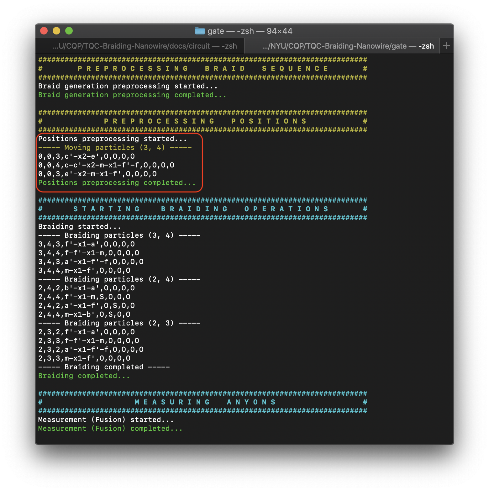
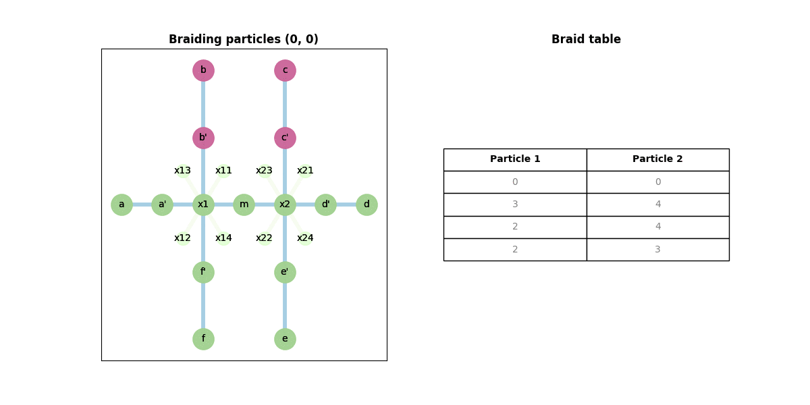
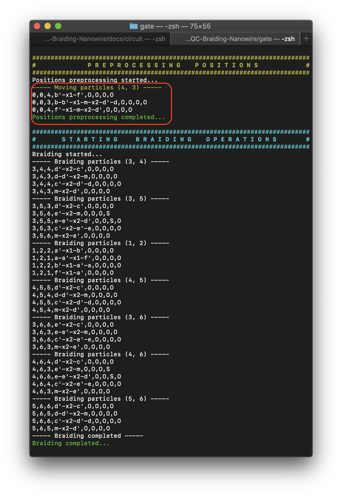
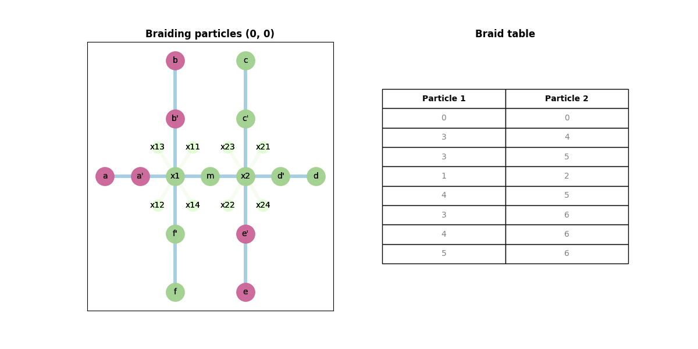
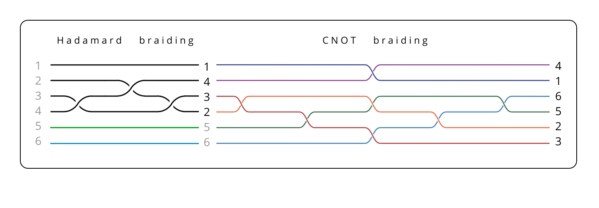
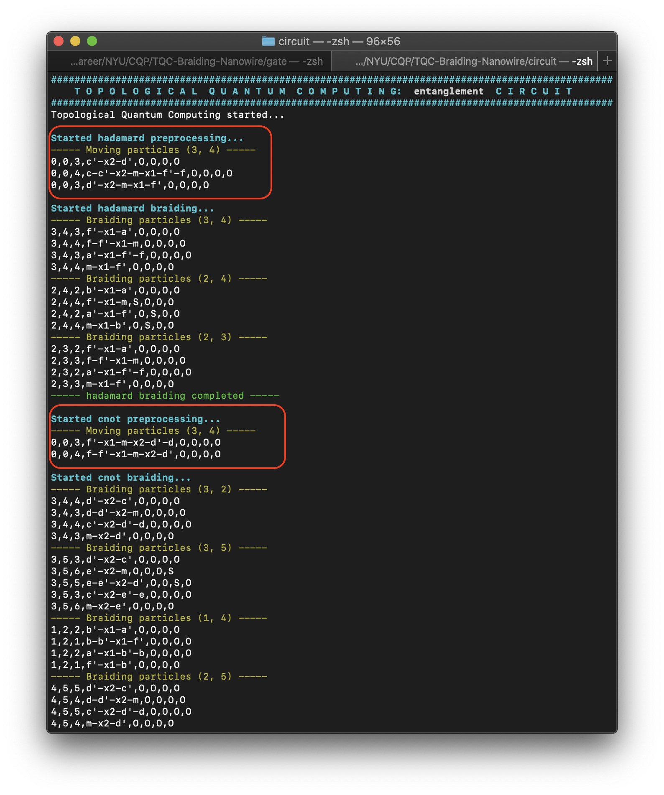
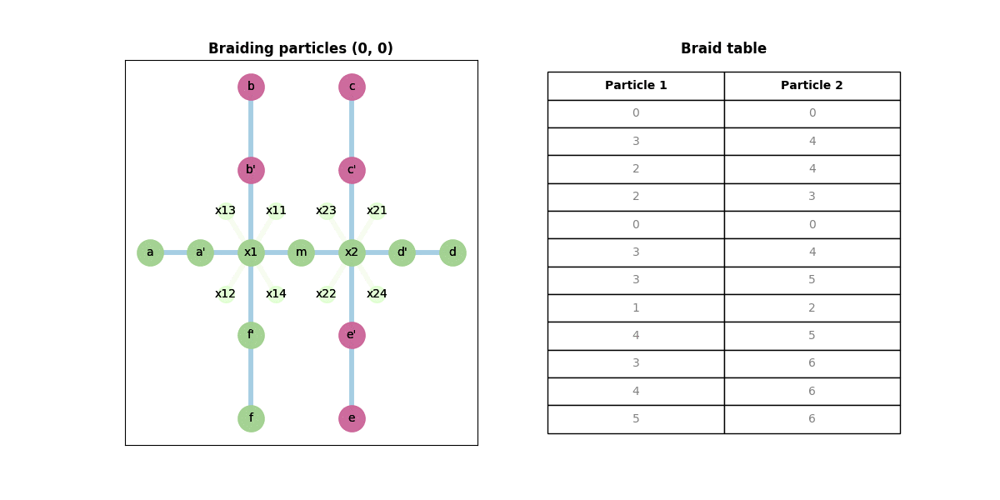
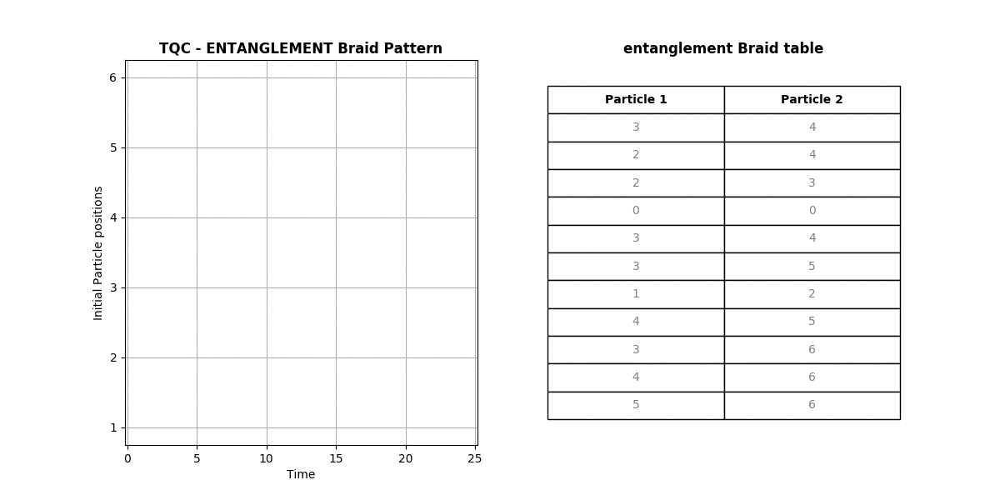
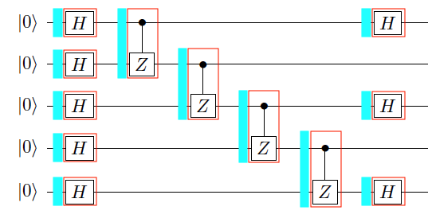

# TQC Compiler for a Quantum circuit

Much of the algorithm is the same as before, except for one new step: **Preprocessing - Braid Positions**, which is after the Preprocessing - Nanowire stage and before the braiding algorithm commences. With this new step, the final set of stages for the Compiler is as follows:
1. Preprocessing - Nanowire
1. Algorithm - Compute Braid
    1. **Preprocessing - Positions**
    1. Braiding Algorithm
1. Algorithm - Measurement
1. Animate - Braid

Another change is in the structure of the _input_ files. They now follow a yaml structure, which is easier and quicker to parse. This is the industry best practice to include the config information. They contain information such as:
1. `circuit-config.yml`
    1. No. of quibts
    1. The gate sequence
    1. Initial positions
    1. Which animations to perform
1. `nanowire.yml`
    1. Structure
    1. Vertices list
    1. Naming convention
1. `fusion.yml`
    1. fusion rules
    1. fusion channels (from different number of qubits)
1. `{gate}-config.yml`
    1. gate: pauli-x, phase-s, hadamard, cnot
    1. branch config, braid sequence

## TQC Preprocessing Particle positions

Each gate requires a certain arrangement of the particle-populated branches. Therefore, given any random arrangement of particles on the Nanowire, this stage moves them into these valid positions on the branches. It is triggered before the braiding algorithm executes for _every_ gate.

For an individual gate, this stage is triggered from the shell script. But, for a circuit this is combined with the braiding phase, as this needs to be triggered before every braiding operation. There are two steps in this stage.

### Validating Branch config

It checks if the positions of particles on the branch and intersections are in a valid state to perform the required braiding. This is because braiding for some gates (Pauli-X, Hadamard, CNOT) involve particles on different branches. Below are the branch configurations for various gates:

1. **Hadamard** and **Pauli-X** gates require the particles to be on **opposite** branches in the **same** intersection. On the given 2-X nanowire, for example, this would be the branch pair `([b,b'], [f,f'])` on the 1st intersection, and `([c,c'], [e,e'])` on the 2nd.

1. **CNOT** gate requires the last 4 (out of 6) particles to be on **adjacent** branches in **clockwise** order in the **same** intersection. On the given Nanowire, that would be the branch pairs, `([b,b'], [a,a'])` and `([a,a'], [f,f'])` on the 1st intersection, and `([c,c'], [d,d'])` and `([d,d'], [e,e'])` on the 2nd.

1. **Phase-S** does not require any such mandatory configuration, as the braiding involves particles on the same branch.

### Moving the particles

If the required particles are not in the valid positions, it tries to move them into the valid state, depending on specified branch config. If it cannot move them, then it returns with an exit status 1 and the program stops. There are two kinds of movements:

1. The zero mode orientation is **preserved**

    - This is when the particle in the outer position in the initial branch is moved to the outer position in the final branch, and the same applies to the particle on the inner position.

    - One example of this is movement in the preprocessing stage before the **hadamard** gate executes.

1. The zero mode orientation is **reversed**

    - This is when the particle in the inner position in the initial branch is moved to the outer position in the final branch, and the same applies to the particle on the outer position.

    - In this case, braiding occurs between the two particles

    - One example of this is movement in the preprocessing stage before the **cnot** gate executes in the **entanglement circuit**.

### Preprocessing Positions - in execution

#### Hadamard gate

As in the image below, the particles, `(3, 4)` are moved from its current branch, `(c',c)`, to the valid branch, `(f',f)`, after which the braiding commences. As it can be seen, the movement **preserves** the zero mode.


The nanowire animation for the same is below:



#### CNOT gate

As in the image below, the particles, `(3, 4)` are moved from its current branch `(b,b')`, to the valid branch, `(d',d)`, after which the braiding commences. As it can be seen, the movement **preserves** the zero mode as well.


The nanowire animation for the same is below:



## Circuit

In a circuit, the output of one gate feeds into another. As a result, some of the particles (may) need to be moved so as to satisfy the valid branch config of the next gate before its execution. Below are the steps for an **entanglement circuit**.

1. Here, we have a **Hadamard** gate, acting on the 1st qubit, followed by a **CNOT** gate, acting on both qubits. For the Hadamard gate, the 1st 4 particles should be on the **1st intersection**. For the CNOT gate, we need the latter two particles from the Hadamard braiding. As they're on the 1st intersection, they need to be moved onto the **2nd intersection**, where the remaining 2 particles are.

1. With the given initial positions `[b,b',c',c]`, before the Hadamard gate, the particles on the branch`(c', c)` need to be moved onto the branch `(f',f)`, as explained before. The positions after the preprocessing stage are `[b,b',f',f]`. Here, if you observe, the zero-mode is _preserved_. The final position after the Hadamard braiding is `[f',b',b,f]`.

1. Now, we need particles `(3, 2)`, which are at positions `(b', b)`, for the CNOT braiding. These need to be moved into the 2nd intersection onto a valid branch, `(d, d')`. Given the remaining 2 particles occupy positions `(e, e')`, they need to be moved into positions `(c, c')`. The path for particle `2` is `[b',x1,m,x2,d',d]` and for particle `3` is `[b,b',x1,m,x2,d']`. As you can observe here, the zero mode orientation is _reversed_. The CNOT gate now executes.

### 2 qubits entanglement circuit

#### Braid sequence and positions

This is the braid diagram for an entanglement circuit.


1. With the initial braid positions, `[1,2,3,4,5,6]`, after the Hadamard gate it is `[1,4,3,2,5,6]`. The Braid sequence for the Hadamard gate is `[(3,4) (2,4), (2,3)]`.

1. The braid positions `[1,4,3,2,5,6]` act as input to the CNOT gate. The braid sequence for the CNOT gate is `[(3,4), (3,5), (1,2), (4,5), (3,6), (4,6), (5,6)]`. However, this sequence is valid for the braid positions `[1,2,3,4,5,6]`.

    - I resolved this issue by creating a mapping as follows: `{1 → 1}, {4 → 2}, {3 → 3}, {2 → 4}, {5 → 5}, {6 → 6}`. This means that all the braids involving particles `4` will be treated as particle `2` and vice versa (as per the mapping).

    - For the braid positions `[1,4,3,2,5,6]`, the new braid sequence is `[(3,2), (3,5), (1,4), (2,5), (3,6), (2,6), (5,6)]`.

1. The complete braid sequence and the corresponding braid positions for the entanglement circuit is (as generated in [braid-output](particle-positions-braid.csv)):
```
(0,0): 1,2,3,4,5,6
(3,4): 1,2,4,3,5,6
(2,4): 1,4,2,3,5,6
(2,3): 1,4,3,2,5,6
(0,0): 1,4,3,2,5,6
(3,2): 1,4,2,3,5,6
(3,5): 1,4,2,5,3,6
(1,4): 4,1,2,5,3,6
(2,5): 4,1,5,2,3,6
(3,6): 4,1,5,2,6,3
(2,6): 4,1,5,6,2,3
(5,6): 4,1,6,5,2,3
```

#### Execution

As displayed in the image below, the particles, `(3, 4)` are moved from its current branch, `(c',c)`, to the valid branch, `(f',f)`, after which the **Hadamard** braiding commences. Following this, and **before** the CNOT braiding commences, particles `(3, 4)` are moved from the branch `(b,b')` to `(d',d)`.


#### Animation

The nanowire animation for the entanglement circuit is below:



The braid animation for the entanglement circuit is below:



The braid animation for the entanglement circuit is below:


### n-qubit circuit

The above algorithm constructs a 2-qubit entanglement circuit. The same can be extended for an n-qubit circuit, as shown below:



The red boxes are the gates, and each blue box represents a pre-processing stage, which is executed _before_ a gate. Thus, the output of the Hadamard gates on qubits `1` and `2` feed into the corresponding **C-Z** gate. The preprocessing stage for this gate, moves the particles constituting qubits `1` and `2` into a valid branch config for the C-Z gate. This repeats for every gate.

The end goal is to construct a nanowire braiding model for a universal set of gates. As any gate can be derived using these, this makes the architecture highly _reusable_, _scalable_ and _automated_.
