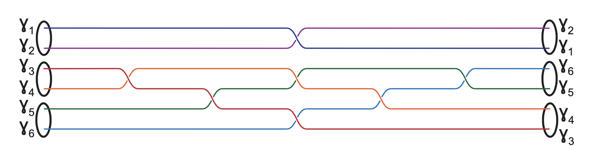

# TQC Compiler - CNOT gate

## CNOT Braid pattern



## Inputs for CNOT

1. Circuit configuration (`circuit-config.csv`) - specifying the gate, number of particles, number of qubits, and total voltage gates
```
gate=cnot
particles=6
qubits=2
voltages=4
```

1. Braid sequence (`braid-sequence.csv`) (with counter-clockwise braiding direction):
```
3,4,0
3,5,0
1,2,0
4,5,0
3,6,0
4,6,0
5,6,0
```

1. Fusion Channel (`fusion-channel.csv`) - this channel is for a 2-qubit gate
```
Q1,Q2,a,b,c
0,0,1,1,1
1,0,x,x,1
0,1,1,x,x
1,1,x,1,x
```

1. Initial particle positions (`initial-positions.csv`):
```
a,a',c,c',d,d'
```

1. Fusion rules (`fusion-rules.csv`) (common):
```
P1,P2,Res
o,o,1
o,o,x
1,o,o
o,1,o
1,1,1
1,x,x
x,1,x
x,x,1
x,o,o
```

1. Nanowire structure (`nanowire-structure.csv`) (common):
```
b,b'
a,a'
f,f'
m
x11,x12
c,c'
m
e,e'
d,d'
x21,x22
```

1. Nanowire positions (`nanowire-positions.csv`) (common):
```
Node,X,Y
b,3,6
b',3,5
a,1,4
a',2,4
f,3,2
f',3,3
m,4,4
x1,3,4
c,5,6
c',5,5
e,5,2
e',5,3
d,7,4
d',6,4
x2,5,4
x11,3.5,4.5
x12,2.5,3.5
x13,2.5,4.5
x14,3.5,3.5
x21,5.5,4.5
x22,4.5,3.5
x23,4.5,4.5
x24,5.5,3.5
```

## Outputs - Animation


