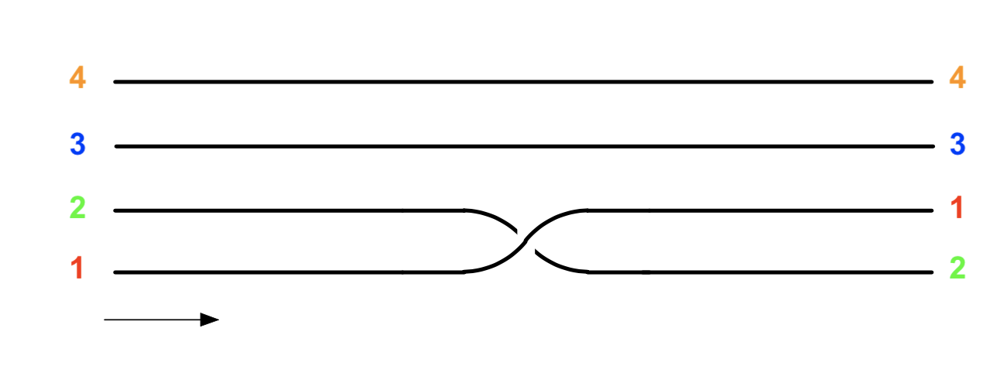
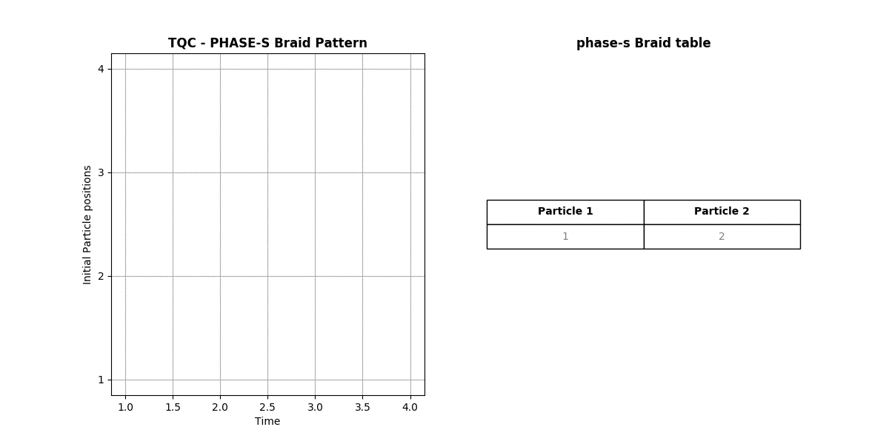
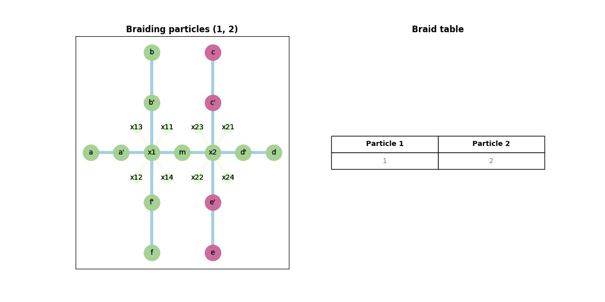

# TQC Compiler - Phase S gate

## Phase S Braid pattern



## Inputs for Phase S

1. Circuit configuration (`circuit-config.csv`) - specifying the gate, number of particles, number of qubits, and total voltage gates
```
gate=phase-s
particles=4
qubits=1
voltages=4
```

1. Braid sequence (`braid-sequence.csv`) (with counter-clockwise braiding direction):
```
1,2,0
```

1. Fusion Channel (`fusion-channel.csv`) - this channel is for a 1-qubit gate
```
Q,a,b
0,1,1
1,x,x
```

1. Initial particle positions (`initial-positions.csv`):
```
c,c',e,e'
```

1. The Fusion rules, Nanowire structure and Nanowire positions are the same as for CNOT.

## Outputs - Animation




