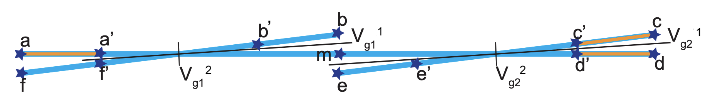
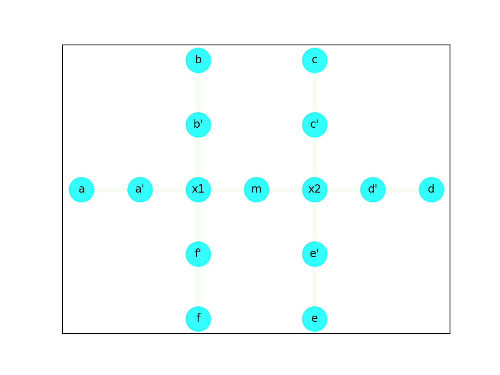
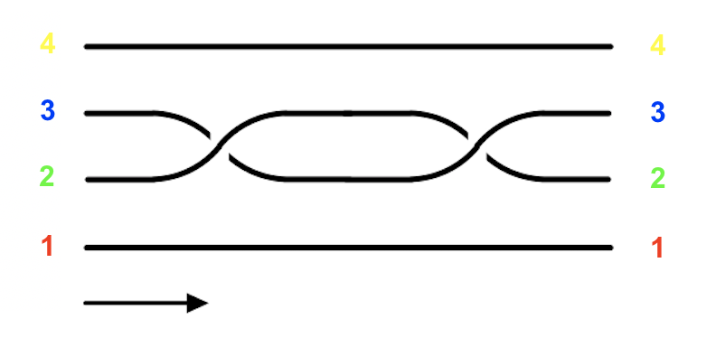
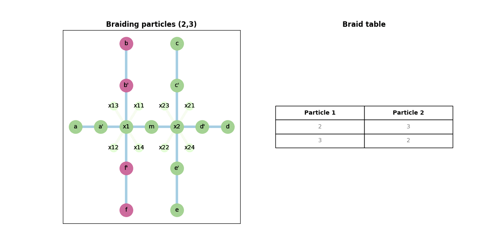
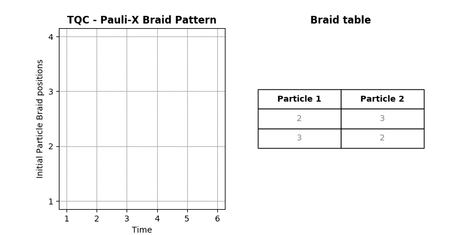
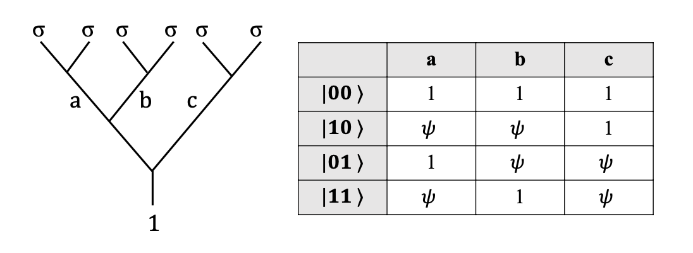

# TQC Nanowire Compiler

## About
In Topological Quantum Computing, quasiparticles such as Majorana fermions are braided in a specific pattern to obtain single- or multi-qubit Quantum gates. Serial or concurrent combinations of braid sequences between 2 quasiparticles forms the braid pattern. Each of these braid sequences correspond to a set of movements of these particles on a Nanowire.

This project is a simulation, which ultimately constructs a matrix representing movements of these particles on a Nanowire, thereby forming braids resulting in Quantum gates.

### Instructions to run

1. ```pip install -r requirements.txt```
2. ```./run.sh```

## TQC Nanowire Compiler

### Preprocessing - Nanowire structure

1. Given a Nanowire structure, an **Adjacency matrix** is constructed, which is used to determine the paths that the particles take in order to form a braid. In the program, ```nanowire-graph.py``` performs this preprocessing. It takes as input ```nanowire-structure.csv``` and outputs the adjacency matrix into ```nanowire-matrix.csv``` and the nanowire vertices into ```nanowire-vertex.csv```.

2. **Representation of the Nanowire** must follow certain rules:
    - Sequence of the branches is **Anti-clockwise**
    - Sequence of the branches is **Topmost and Leftmost**
    - Naming Sequence of the positions is **Outward to inward**
    - Each intersection is followed by the **Voltage gates**



3. This is a Double-X junction Nanowire. It would be represented in (```nanowire-structure.csv```) as:
```
b,b'
a,a'
f,f'
m
x11,x12
c,c'
m
e,e'
d,d'
x21,x22
```

4. One of the outputs of ```nanowire-graph.py``` is a sequence of vertices of the Nanowire, saved in ```nanowire-vertex.csv```. One of the sequence is ```m,d',a',b',a,c,b,f',e,c',f,d,x2,e',x1```.

5. The other output of ```nanowire-graph.py``` is the adjacency matrix of the Nanowire, saved in ```nanowire-matrix.csv```. The matrix for the above sequence and the given nanowire structure is
```
1,0,0,0,0,0,0,0,0,0,0,0,1,0,1
0,1,0,0,0,0,0,0,0,0,0,1,1,0,0
0,0,1,0,1,0,0,0,0,0,0,0,0,0,1
0,0,0,1,0,0,1,0,0,0,0,0,0,0,1
0,0,1,0,1,0,0,0,0,0,0,0,0,0,0
0,0,0,0,0,1,0,0,0,1,0,0,0,0,0
0,0,0,1,0,0,1,0,0,0,0,0,0,0,0
0,0,0,0,0,0,0,1,0,0,1,0,0,0,1
0,0,0,0,0,0,0,0,1,0,0,0,0,1,0
0,0,0,0,0,1,0,0,0,1,0,0,1,0,0
0,0,0,0,0,0,0,1,0,0,1,0,0,0,0
0,1,0,0,0,0,0,0,0,0,0,1,0,0,0
1,1,0,0,0,0,0,0,0,1,0,0,1,1,0
0,0,0,0,0,0,0,0,1,0,0,0,1,1,0
1,0,1,1,0,0,0,1,0,0,0,0,0,0,1
```

Below is the graphical representation of the Nanowire...



### Preprocessing - Braid sequence



Given a Braid pattern for a Quantum gate, it needs to be processed into a sequence of braids between 2 particles. These sequences, in turn, combine to form the braid pattern. For this Braiding pattern, which is a 2-Qubit Pauli-X gate, the braid sequence saved in ```braid-sequence.csv``` is:
```
3,4
3,5
1,2
4,5
3,6
4,6
5,6
```

### Preprocessing - Initial Particle positions

A file, ```particle-positions.csv```, contains the initial positions of the particles on the Nanowire. In the above example, it is ```a,a',c,c',d,d'```.

### TQC Braiding Nanowire Algorithm

### Algorithm - Rules

1. **Nanowire State validity** - Every braiding operation MUST result in a valid Nanowire state. Validity can be generic or for the next braiding operation.
    - EVERY braiding operation, either optimized or not, concurrent or not, must result in a valid Nanowire state.
    - So, the input and output of every braiding operation is a valid Nanowire state.
2. **Atomic Braiding operation** - Every braid involves 2 particles, i.e., BOTH these particles needs to be moved in a braiding operation.
        - As the state before the braiding is valid, there is no obstruction during braiding for any particle.
3. **Particle-Zero mode isolation** - No two particles from different zero modes can occupy adjacent positions on the Nanowire during the braiding operation.
    - Also, when 2 particles from different zero-modes are being braided, their **non-participating** paired zero-mode particles cannot be on the same crossing. This would involve voltage regulation.
    - After the braiding is completed, they can only occupy the valid final positions.
4. **Braiding Sequence** - The sequence of the braids must be strictly followed for the given gate and braiding pattern. Any random braiding sequence may lead to a different gate and hence would be disallowed.
5. **Braiding Concurrency limits** - there is a limit on the # concurrent braiding operations
    - There is a layer of optimization, where more than one braiding optimization can be performed simultaneously, depending on the nanowire structure.
6. **Intermediate positions** - Every braiding operation puts the particles back in their respective final positions.
    - There is a layer of optimization possible here. The particles can be placed in an intermediate position, so long as it does not violate any rules, interfere with other braiding operations or is needed in subsequence braiding operations.
7. **Braiding rotation** - Mathematically, clockwise braiding results in a Matrix which is different than anti-clockwise braiding.
    - If an anti-clockwise braiding of 2 particles involves movements in vertical-top followed by vertical-bottom branches, then a clockwise braiding would be the opposite.
    - If an anti-clockwise braiding involves horizontal followed by vertical branches, then a clockwise braiding would (probably) be vertical followed by horizontal.
    - The detail mechanics would still need to be worked out. This would essentially be another layer of upgrade on top of the current, basic one. The default would always be anti-clockwise.
8. **Fusion** - For fusion, the particles involved must be adjacent to each other.

### Algorithm - Validation phase

1. **Get Final Positions** - Retrieve the **expected Final positions** for the participating particles, AFTER the Braiding operation is completed.
    - **Get Empty Positions** - on adjacent empty branches (returns both nearest and farthest locations on the branch)
    - There can be **multiple** final positions, if there are more than one free branches.
    - If there are no empty branches available, then a ```NoEmptyPositionException``` exception is raised and ```braiding stops```
    - These positions are then **ranked** based on their
        - Nanowire Validity score
        - Number of steps
        - If the positions are useful in further braiding

2. **Get Intermediate Positions** - Retrieve the **potential Intermediate positions** for the participating particles, for the Braiding operation.
    - If there are no empty branches available, then a ```NoEmptyPositionException``` exception is raised and ```braiding stops```
    - Once validity is confirmed, move the particles to their intermediate positions
    - 1st particle that moves gets the 1st empty branch (for now)
    - Later, any rules/restrictions to move particles to certain branches can be specified

3. **Validate Resulting State** - **Nanowire validation algorithm** which returns a ```score (>= 0)``` for every expected final position.
    - If ```score = 0```, then the state is **invalid**, an ```InvalidNanowireStateException``` is raised and the **braiding stops**.
    - If ```score > 0```, then the state is **valid** and it's safe to continue with the braiding.
    - Initially, ```score = 0```.
    - If the resulting states have **at least 2** empty branches in each intersection, ```score += 1```.
    - If the resulting states do not interfere in the movement of the 2nd particle involved in the braiding, ```score += 1```.
    - If the resulting states do not interfere in the further braiding operations, ```score += 1```.

### Algorithm - Braiding Phases

4. **Get Voltage Changes** - If the particles are from the same zero-mode, then voltage regulation is unnecessary. But, if braiding involves particles from different zero modes, perform necessary voltage gate changes. This may cut-off some branches.
    - For every particle, based on given the final position, choose whether to **open or close** the gate voltages.
    - Once the voltages are updated, the resultant isolated branches can be retrieved.

5. **Retrieve Isolated branches** - Instead of actually updating the Adjacency matrix, retrieve the list of isolated branches and its positions involved in the movement of the particle.
    - The isolated branch is a subset of vertices from the original set of vertices
    - The resulting adjacency matrix, involving this subset of vertices, is a subset of the original matrix

6. **Get Shortest Path** - Dijkstra's algorithm gives the shortest path for a particle from it's current (initial) position to the given (valid) final position.

7. **Update Particle Positions** - Generate a sequence of position-voltage pair, for every step of the involved particles for every braiding operation. It is updated in the file ```particle-movements.csv```, as shown below (which is the ideal output format):
```
Particle,Path,V11,V12,V21,V22
2,a'-b,O,O,O,O
1,a-a'-f',O,O,O,O
2,b-a'-a,O,O,O,O
1,f'-a',O,O,O,O
```

### Output

8. **Nanowire State matrix** - Generate a Nanowire State matrix, which is a sequence of positions of all particles and the corresponding gate voltage values, capturing each movement for every particle. The nanowire state matrix for the above example is show below.


9. **Metrics** - Calculate metrics such as **Number of steps** (both within and between zero modes, and total), **Braiding Concurrency**, **Effective complexity**, etc.

### Work Done

### Stage 1

1. This is the basic implementation, so some of the rules (3, 5, 6 and 7) haven't been included in the algorithm.

2. The entire braiding operations are of 2 basic categories:
    - The braiding involves 2 particles on the **same branch**. Sequences (3, 4), (1, 2), (4, 5), (3, 6) and (5, 6) belong to this category.
    - The braiding involves 2 particles on the **different branches** AND one particle is on the **inner position** on one branch AND the other particle is on the **outer position** of the other branch AND another particle on the inner position on the latter branch is blocking the latter particle. Sequences (3, 5) and (4, 6) belong to this category. Voltage regulation is required ONLY in this case.

3. The output, for the given braiding sequence, is displayed below (without the comments in ```particle-movements.csv```):
```
Braiding particles (3, 4)
4,c'-x2-m
3,c-c'-x2-e'
4,m-x2-c'-c
3,e'-x2-c'
Braiding particles (3, 5)
3,c'-x2-m
6,d'-x2-e'
5,d-d'-x2-c'
3,m-x2-d'-d
6,e'-x2-d'
Braiding particles (1, 2)
2,a'-x1-b'
1,a-a'-x1-f'
2,b'-x1-a'-a
1,f'-x1-a'
Braiding particles (4, 5)
5,c'-x2-m
4,c-c'-x2-e'
5,m-x2-c'-c
4,e'-x2-c'
Braiding particles (3, 6)
6,d'-x2-m
3,d-d'-x2-e'
6,m-x2-d'-d
3,e'-x2-d'
Braiding particles (4, 6)
4,c'-x2-m
3,d'-x2-e'
6,d-d'-x2-c'
4,m-x2-d'-d
3,e'-x2-d'
Braiding particles (5, 6)
6,c'-x2-m
5,c-c'-x2-e'
6,m-x2-c'-c
5,e'-x2-c'
```

4. The Nanowire state matrix for the braiding sequence ```(3,5)``` is (in ```nanowire-states.csv```):
```
P1,P2,P3,P4,P5,P6
a,a',c',c,d,d'
a,a',x2,c,d,d'
a,a',m,c,d,d'
a,a',m,c,d,d'
a,a',m,c,d,x2
a,a',m,c,d,e'
a,a',m,c,d,e'
a,a',m,c,d',e'
a,a',m,c,x2,e'
a,a',m,c,c',e'
a,a',m,c,c',e'
a,a',x2,c,c',e'
a,a',d',c,c',e'
a,a',d,c,c',e'
a,a',d,c,c',e'
a,a',d,c,c',x2
a,a',d,c,c',d'
```

### Stage 2

5. Rule 3 with voltage regulations (for braiding in the 2nd category).

6. In every braiding operation, I extract the particles which are isolated (1 in a branch).
    - I then verify if these isolated particles are part of the same zero mode, or different. If they are part of the same zero mode, then no voltage regulation is needed.
    - Otherwise, I check if the particles are part of the (expected) zero modes which might be formed after the braiding is completed. If so, then no voltage regulation is needed.
    - If both the particles aren't part of either an existing zero mode or an expected zero mode, then the voltage gate between those adjacent branches need to be shut off.

7. In the case when a braiding operation involves 5 steps - for sequences ```(3,5)``` and ```(4,6)``` - step 3 (which involves moving particle 5 to position of particle 3 and moving particle 6 to position of particle 4 respectively) requires a toggling of both voltage gate values in the respective intersection.
    - In the 1st case, step 2 is moving particle 6: ```[d', e']```. The voltage gate values ```x21, x22``` for this are ```S, O```.
    - In step 3, which is moving particle 5: ```[d, d', c']```, the voltage gate values ```x21, x22``` are ```O, S```.
    - Following this, in steps 4 and 5, as there is no interference between 2 particles from different zero modes, no further voltage regulation is needed.

8. I first generate a nested list of pairs of positions for which voltage gate shut is triggered. For gate ```x21```, the pairs are ```[['c', 'd'], ['c', "d'"], ["c'", 'd'], ["c'", "d'"], ['e', 'm'], ["e'", 'm']]```. So, if a pair of position of particles from different zero modes is in this list, then ```x21``` is triggered to shut. Similar is the case for other gates as well.

9. Every time the nanowire structure is updated, the zero mode pairs are also updated. While braiding particles ```(3,5)``` the zero mode pairs are as follows: ```[(1, 2), (5, 6)], [(1, 2)], [(1, 2), (4, 5)], [(1, 2), (4, 5), (3, 6)]```

10. In every braiding operation, after every successful intermediate braiding, the voltage gates are also updated. While braiding particles ```(3,5)``` the voltage gate values changes as follows: ```['O', 'O', 'O', 'O'], ['O', 'O', 'S', 'O'], ['O', 'O', 'O', 'S'], ['O', 'O', 'O', 'O'], ['O', 'O', 'O', 'O']```. 'O' means a gate is open and 'S' means it is shut. The gate array represents ```[x11,x12,x21,x22]``` in this order.

11. The output with the voltage changes are as follows:
    - Particle movements:
    ```
    ----- Braiding particles (3, 4) -----
    4,c'-x2-m,O,O,O,O
    3,c-c'-x2-e',O,O,O,O
    4,m-x2-c'-c,O,O,O,O
    3,e'-x2-c',O,O,O,O
    ----- Braiding particles (3, 5) -----
    3,c'-x2-m,O,O,O,O
    6,d'-x2-e',O,O,S,O
    5,d-d'-x2-c',O,O,O,S
    3,m-x2-d'-d,O,O,O,O
    6,e'-x2-d',O,O,O,O
    ----- Braiding particles (1, 2) -----
    2,a'-x1-b',O,O,O,O
    1,a-a'-x1-f',O,O,O,O
    2,b'-x1-a'-a,O,O,O,O
    1,f'-x1-a',O,O,O,O
    ----- Braiding particles (4, 5) -----
    5,c'-x2-m,O,O,O,O
    4,c-c'-x2-e',O,O,O,O
    5,m-x2-c'-c,O,O,O,O
    4,e'-x2-c',O,O,O,O
    ----- Braiding particles (3, 6) -----
    6,d'-x2-m,O,O,O,O
    3,d-d'-x2-e',O,O,O,O
    6,m-x2-d'-d,O,O,O,O
    3,e'-x2-d',O,O,O,O
    ----- Braiding particles (4, 6) -----
    4,c'-x2-m,O,O,O,O
    3,d'-x2-e',O,O,S,O
    6,d-d'-x2-c',O,O,O,S
    4,m-x2-d'-d,O,O,O,O
    3,e'-x2-d',O,O,O,O
    ----- Braiding particles (5, 6) -----
    6,c'-x2-m,O,O,O,O
    5,c-c'-x2-e',O,O,O,O
    6,m-x2-c'-c,O,O,O,O
    5,e'-x2-c',O,O,O,O
    ```

    - Nanowire states:
    ```
    P1,P2,P3,P4,P5,P6,Vg11,Vg12,Vg21,Vg22
    a,a',c',c,d,d',O,O,O,O
    a,a',x2,c,d,d',O,O,O,O
    a,a',m,c,d,d',O,O,O,O
    a,a',m,c,d,d',O,O,S,O
    a,a',m,c,d,x2,O,O,S,O
    a,a',m,c,d,e',O,O,S,O
    a,a',m,c,d,e',O,O,O,S
    a,a',m,c,d',e',O,O,O,S
    a,a',m,c,x2,e',O,O,O,S
    a,a',m,c,c',e',O,O,O,S
    a,a',m,c,c',e',O,O,O,O
    a,a',x2,c,c',e',O,O,O,O
    a,a',d',c,c',e',O,O,O,O
    a,a',d,c,c',e',O,O,O,O
    a,a',d,c,c',e',O,O,O,O
    a,a',d,c,c',x2,O,O,O,O
    a,a',d,c,c',d',O,O,O,O
    ```

12. Rule 7 - Braiding Direction. Here, the particle movement occurs in the opposite (clockwise) direction

13. This rule was implemented by changing the format of the ```braid-sequence.csv``` file.
    - It was originally of the format:
    ```
    3,4
    3,5
    1,2
    4,5
    3,6
    4,6
    5,6
    ```
    - I changed this format by adding a bit which indicates the direction of braiding rotation next to the pair or particles. ```1``` represents clockwise braiding and ```0``` represents counter-clockwise braiding (which is the default one). The new format and the corresponding output is as follows:
    ```
    3,4,1
    3,5,1
    1,2,1
    4,5,1
    3,6,1
    4,6,1
    5,6,1
    ```
    - Below is the Particle movements output for clockwise braiding. For braiding between ```(3,5)```, after the 1st step, the positions are as follows: ```['a', "a'", "e'", 'c', 'd', 'm']```. The pair ```["e'", 'm']``` represents the particles ```[3,6]``` and ```["e'", 'd']``` represents ```[3,5]```, BOTH of which do NOT belong to a zero mode. Therefore, the gates ```[X21,X22]``` must be shut, to preserve Rule 3.
    - As a result, this blocks the movement of particle 6. Hence, this braiding cannot proceed in the clockwise direction with the given initial positions.

    ```
    ----- Braiding particles (3, 4) -----
    4,c'-x2-e',O,O,O,O
    3,c-c'-x2-m,O,O,O,O
    4,e'-x2-c'-c,O,O,O,O
    3,m-x2-c',O,O,O,O
    ----- Braiding particles (3, 5) -----
    3,c'-x2-e',O,O,O,O
    The Particle (6) with Path [d',x2,m] is blocked by Voltage Gate ['x21']
    ```

### Stage 3

13. Animation - Used Python's Networkx and Pyplot libraries to create animations of the whole Pauli-X Braiding algorithm
    - Nanowire movement
    

    - Braiding animation
    

### Stage 4

14. Documentation and README

15. Measurement - Fusion

    - Firstly, the Fusion rules are important here, which varies between particle types - Majorana, Fibonacci, etc. The Fusion rules for this project are listed in ```fusion-rules.csv``` as shown below. ```o, x, 1``` represent the anyonic quasiparticles, fermions and vacuum respectively.
    ```
    P1,P2,Res
    o,o,1
    o,o,x
    1,o,o
    o,1,o
    1,1,1
    1,x,x
    x,1,x
    x,x,1
    x,o,o
    ```

    - Secondly, the Fusuon channels for anyons is as shown in the figure below.
    
    The corresponding table is in ```fusion-channel.csv``` as below. The 1st 2 columns represent the 2 qubits and the next (last) 3 columns, the channels, as shown in the figure.
    ```
    Q1,Q2,a,b,c
    0,0,1,1,1
    1,0,x,x,1
    0,1,1,x,x
    1,1,x,1,x
    ```

    - Thirdly, The final positions of the particles AFTER braiding is stored and they are paired based on their adjacency positions from the Nanowire Matrix graph. In this case the final positions are ```a',a,d',d,c',c```. And the zero mode pairs are ```(a', a)```, ```(d', d)```, ```(c', c)```.

    - Finally, measurement happens according to the fusion rules listed earlier. The output is listed in ```tqc-paulix-fusion.csv```. The 1st 3 columns are the channels which we get when measured, and the corresponding Qubit pairs.
    ```
    Pair1,Pair2,Pair3,Qubit1,Qtubi2
    x,1,x,1,1
    x,x,1,1,0
    1,x,x,0,1
    1,x,x,0,1
    x,x,1,1,0
    x,x,1,1,0
    x,1,x,1,1
    1,x,x,0,1
    x,x,1,1,0
    x,1,x,1,1
    x,1,x,1,1
    x,1,x,1,1
    ```

    - With this stage, the entire Topological Quantum Braiding is complete, from Particle Initialization to Braiding to Measurements.

16. Fusion - Animation

### Stage 5 - Universal Gate set

17. Hadamard (1 Qubit)
18. X (1 Qubit)

### Stage 6

19. Redesign Compiler architecture

### Stage 7

20. Preprocessing - Generating Braid sequence for a given circuit
